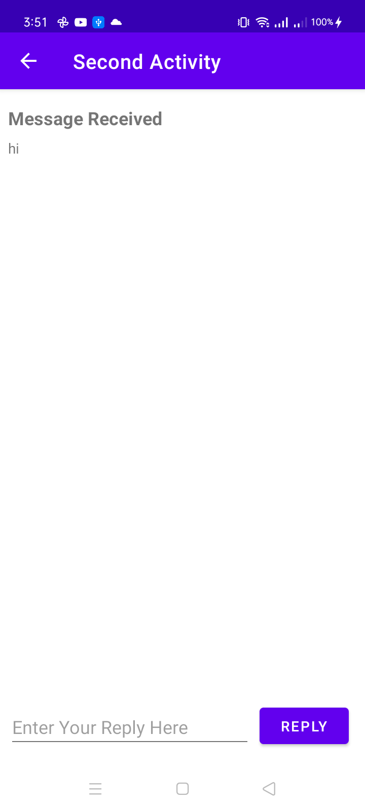

##Lab 4 Two Activities

### task

**This is the interface of the app when the app starts**

**when you type message and send it then the message will be delivered to second activity and message from second activity will be appeared here**

**when you type message and send it then the message will be delivered to main activity
and message sent from main activity will be apeared here**